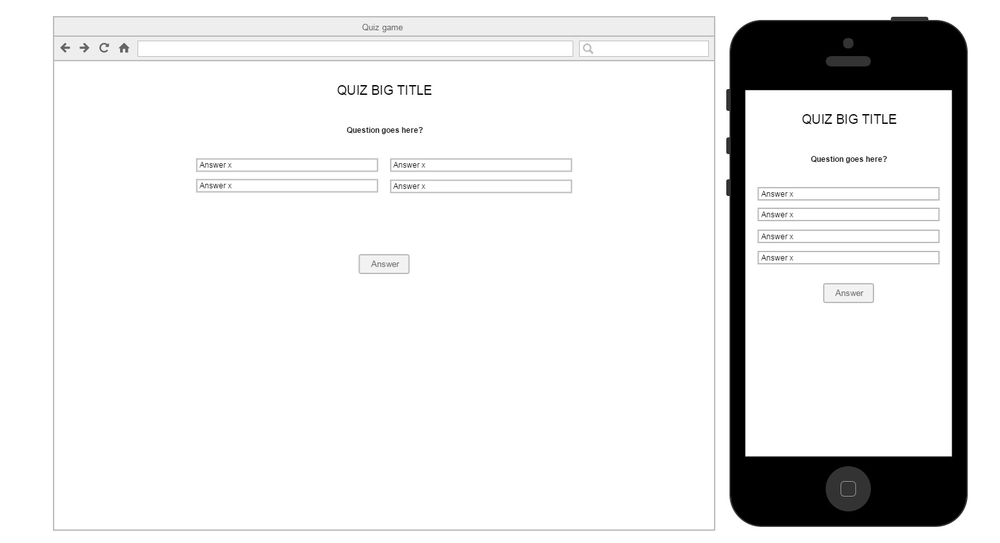

#Quiz video game

You have to make a quiz web app using the json data provided.

##Requirements

- player can see one question at the time +
- player can see a score at the end +
- player should not see the same order of questions next time quiz is taken +
- you cannot edit the json file +
- make the game one HTML page +
- quiz have to be responsive and can be played on mobile device +
- use assets we provide or make your own or use CSS +
- use a Google Web Font (https://www.google.com/fonts) of your choice +
- you can use Bootstrap, MaterializeCSS or no framework as desired +

Nice to Have:
- Add an intro screen with a cta PLAY or PLAY AGAIN if player have played the game already -+-
- Add animation for correct and incorrect answered by the player using CSS3 only --
- Add play again functionality -- {save scores in local storage}
##Mocks

